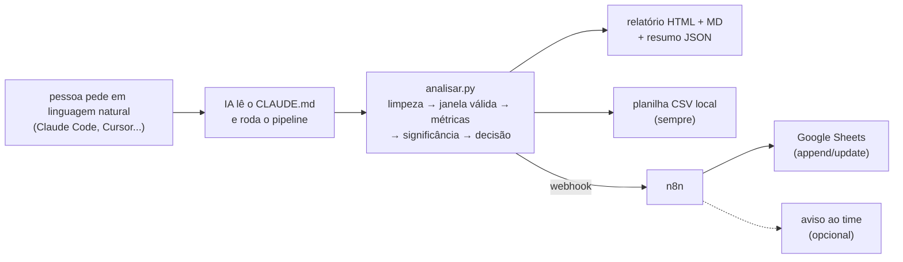

# Análise de testes A/B de cashback — case Méliuz

Solução reutilizável pra responder a pergunta central do case: **"dado esse teste A/B,
qual variante de cashback devemos escalar pra 100% do tráfego?"**

Qualquer CSV no schema do case entra, e sai: relatório apresentável pra gestor (HTML + Markdown),
decisão com justificativa e teste de significância, e a linha registrada na planilha de
acompanhamento. Os 3 datasets fornecidos rodam sem mudar uma linha de código — só apontando o arquivo.

> 🔗 **Planilha de acompanhamento (Google Sheets):** COLE_AQUI_O_LINK_DA_PLANILHA
>
> Versão mínima em CSV: [`planilha/acompanhamento_testes.csv`](planilha/acompanhamento_testes.csv)

## Como pensei a arquitetura

A ideia do case é que qualquer pessoa do time abra uma ferramenta de IA, peça "analisa esse teste"
e receba a resposta. A decisão mais importante que tomei foi **separar o que é determinístico do
que é conversa**:



- **A análise é um script Python, não um prompt.** Número de teste A/B não pode variar conforme
  o humor do modelo: o mesmo dataset tem que dar sempre o mesmo resultado, auditável linha a linha.
  A IA entra como *interface* — interpreta o pedido, roda o script, explica o resultado — seguindo
  as instruções do [`CLAUDE.md`](CLAUDE.md).
- **O registro na planilha passa pelo n8n** ([workflow pronto pra importar](n8n/)): o script envia
  o resumo por webhook e o n8n faz o append/update no Google Sheets. A credencial do Google fica num
  lugar só, o registro é idempotente (rodar de novo atualiza a linha em vez de duplicar) e o mesmo
  webhook já serve de gancho pra avisar o time. O CSV local é gerado sempre, então nada depende do
  n8n estar de pé.
- **Robustez a dado ruim é regra de negócio, não try/except.** Além da limpeza estrutural (moeda BR,
  duplicatas, nulos, datas), o pipeline valida o *desenho do teste* — e foi isso que salvou a análise
  desses 3 datasets (detalhes abaixo).

## Como rodar

```bash
pip install -r requirements.txt

python analisar.py dados/dataset_01_parceiroA.csv   # um teste
python analisar.py --todos                          # os três de uma vez
python analisar.py <arquivo> --sem-registro         # sem escrever na planilha
```

Saída de cada teste: `relatorios/<parceiro>.html` (pra apresentar), `.md` (pra ler aqui no GitHub)
e `.json` (resumo estruturado que alimenta a planilha e o webhook).

**Pelo assistente de IA:** abra o repositório no Claude Code (ou Cursor etc.) e peça em linguagem
natural — "analisa o teste do Parceiro B", "chegou um CSV novo, qual variante escalar?". As
instruções que o assistente segue estão no [`CLAUDE.md`](CLAUDE.md).

**Registro direto no Google Sheets (opcional):** importe o workflow de [`n8n/`](n8n/), conecte a
credencial, cole a URL do webhook num `.env` (tem um [`.env.exemplo`](.env.exemplo)) e todo teste
analisado passa a cair na planilha compartilhada sozinho.

## O que a análise faz

1. **Limpeza com log.** Converte moeda em formato brasileiro ("R$ 1.234"), valida datas, remove
   duplicatas e nulos. Nada é descartado em silêncio — cada problema vira um alerta no relatório.
2. **Reconstrói o tratamento real.** O % efetivo de cashback de cada grupo em cada dia é
   `cashback ÷ GMV`. É isso que revela se o teste que está no papel é o que aconteceu de verdade.
3. **Delimita a janela válida.** A comparação usa só o trecho em que cada grupo mantém o % com que
   o teste começou e as variantes são distintas entre si. Teste alterado no meio ou promoção global
   que iguala todo mundo → o período contaminado sai da conta (e o relatório mostra o que foi cortado).
4. **Calcula os KPIs por grupo** na janela válida: compradores/dia, GMV/dia, ticket, comissão,
   cashback, e a métrica de decisão — **margem líquida (comissão − cashback)**, que é o que sobra
   pro Méliuz. Cashback maior quase sempre compra mais GMV; a pergunta certa é a que custo.
5. **Testa a significância do jeito certo pra esse desenho.** Os grupos vivem o mesmo calendário,
   então comparo a **diferença diária** entre vencedor e vice (pareado por dia) com teste de
   permutação (10 mil reamostragens) + IC95% via bootstrap. Isso cancela fim de semana, promoção
   e sazonalidade que atingem todos os grupos ao mesmo tempo.
6. **Aplica regras de decisão explícitas.** Vencedor = maior margem líquida/dia, com estatística
   confirmando; compradores e GMV entram como guardrail — quando o grupo que mais cresce não é o
   que mais deixa margem, o relatório calcula quanto custa cada comprador incremental e quanto ele
   devolve de comissão, pro gestor decidir com o trade-off na mesa. Alertas de desenho derrubam a
   confiança da recomendação (alta/média/baixa).

## Resultados dos 3 testes

| Teste | Variantes | Janela usada | Decisão | Margem do vencedor |
|---|---|---|---|---|
| Parceiro A (jan–abr) | 3% · 5,5% · 8% | 01/01 a 22/02 (53 dias) | **Escalar Grupo 1 (3%)** — confiança média | R$ 5.420/dia (+17% vs vice, p<0,001) |
| Parceiro B (mai–jun) | 4% · 6% · 9% | período todo (61 dias) | **Escalar Grupo 1 (4%)** — confiança média | R$ 4.698/dia (+100% vs vice, p<0,001) |
| Parceiro C (jul–ago) | 5% · 7% | período todo (45 dias) | **Escalar Grupo 1 (5%)** — confiança alta | R$ 773/dia (vice zera a margem) |

O que cada dataset escondia — e que uma média simples do período inteiro erraria:

- **Parceiro A: o teste foi mexido no meio.** Até 22/02 os grupos praticavam 3% / 5,5% / 8%. Em 23/02
  os tratamentos mudaram (Grupo 1 foi pra 5%, Grupo 3 caiu pra 4%), entre 11 e 14/03 todo mundo subiu
  pra 10% com take de 15,5% (promoção global) e dali em diante os três ficaram iguais em ~5%. Analisar
  o período inteiro mistura regimes e distorce tudo — a ferramenta corta em 22/02 automaticamente.
  No trecho válido, cashback maior comprou crescimento (+28% de compradores no 8%), mas cada comprador
  incremental custou R$ 160 de cashback pra devolver R$ 80 de comissão: não se paga sem LTV.
- **Parceiro B: os volumes não fecham com um split igualitário.** 43% / 29% / 27% dos compradores, e
  justamente o grupo de MENOR cashback com mais gente — o contrário do que o incentivo faria. Sem a
  contagem de usuários expostos não dá pra cravar a causa, então o relatório avisa que comparações
  absolutas estão comprometidas. A decisão se sustenta mesmo assim porque o 4% ganha também nas
  métricas relativas (margem de 7% do GMV vs 5% e 2%; R$ 36 vs R$ 26 e R$ 10 por comprador).
- **Parceiro C: variante estruturalmente inviável + fim de teste quebrado.** O take desse parceiro é
  7%, e o Grupo 2 dava 7% de cashback — repassava 100% da comissão, margem zero por construção, sem
  lift real de compradores em troca (p=0,91 na comparação pareada de compradores). E nos últimos 5
  dias o volume do Grupo 2 despencou pra ~40% do normal com o Grupo 1 estável — cara de tracking ou
  oferta fora do ar, o relatório manda checar com o parceiro.

## Estrutura do repositório

```
analisar.py       ponto de entrada (CLI)
analise_ab.py     motor: limpeza, regimes/janela válida, métricas, permutação, decisão
relatorio.py      relatórios HTML (gráficos SVG + tooltip) e Markdown, resumo JSON
registro.py       planilha CSV + webhook do n8n
CLAUDE.md         instruções pro assistente de IA operar o repo
dados/            os 3 datasets do case
relatorios/       relatórios gerados (html, md, json)
planilha/         acompanhamento_testes.csv (1 linha por teste)
n8n/              workflow do Google Sheets + como configurar
```

## Limitações e o que eu faria com mais tempo

- O dataset não tem **usuários expostos** por grupo, então não dá pra calcular conversão nem validar
  o split de tráfego (ficou evidente no Parceiro B). Seria o primeiro campo que eu pediria pra
  instrumentar nos próximos testes.
- A margem considera comissão − cashback; **custos operacionais e LTV ficam de fora**. O trade-off de
  crescimento vs margem fica calculado no relatório justamente pra essa conversa.
- Com mais tempo: análise de decaimento do efeito ao longo das semanas (efeito novidade — deu pra ver
  no Parceiro C), detecção de outliers com tratamento configurável, e um workflow n8n que baixa o CSV
  do Drive e roda tudo sozinho quando um teste novo é exportado.

---

*João Paulo Motta — case técnico do processo de estágio em Operações Integradas (Méliuz), julho/2026.*
